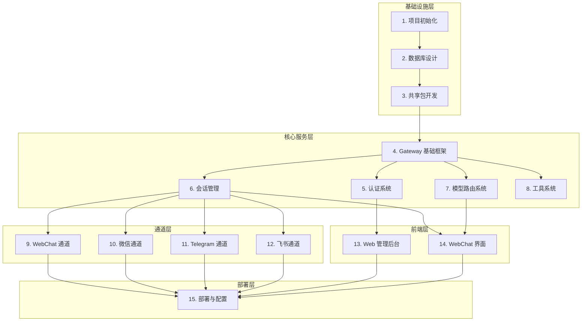

# OpenClaw 个人 AI 助手 - 原子化任务拆分

## 任务依赖图



---

## Phase 1: 基础设施层

### 任务 1: 项目初始化

**任务 ID**: T001  
**优先级**: P0  
**预估工时**: 4 小时  
**状态**: 🔲 未开始

#### 输入契约
- 项目目录: `d:\Antigravity\opc\openclaw`
- Node.js ≥ 22
- pnpm 包管理器

#### 输出契约
- 完整的 monorepo 项目结构
- 根 package.json 配置
- TypeScript 配置
- ESLint + Prettier 配置
- 开发环境运行正常

#### 实现约束
- 使用 pnpm workspaces
- TypeScript 严格模式
- 统一代码规范

#### 详细步骤
```bash
# 1. 初始化根项目
pnpm init

# 2. 创建目录结构
mkdir -p apps/gateway apps/web packages/shared packages/ai-sdk
mkdir -p docs scripts prisma

# 3. 配置 pnpm-workspace.yaml
# 4. 配置根 package.json (scripts, devDependencies)
# 5. 配置 TypeScript
# 6. 配置 ESLint + Prettier
# 7. 配置 Husky + lint-staged
```

#### 验收标准
- [ ] `pnpm install` 成功执行
- [ ] `pnpm dev` 能启动开发环境
- [ ] `pnpm lint` 无错误
- [ ] `pnpm build` 成功构建

---

### 任务 2: 数据库设计

**任务 ID**: T002  
**优先级**: P0  
**预估工时**: 6 小时  
**状态**: 🔲 未开始  
**依赖**: T001

#### 输入契约
- 架构设计文档中的数据库设计
- MySQL 8.0 环境

#### 输出契约
- Prisma schema 文件
- 数据库迁移脚本
- Prisma Client 生成
- 数据库连接工具

#### 实现约束
- 使用 Prisma ORM
- 字段命名使用 snake_case
- 所有表必须有 created_at 和 updated_at
- 外键必须建立索引

#### 详细步骤
```bash
# 1. 安装 Prisma
pnpm add -D prisma
pnpm add @prisma/client

# 2. 初始化 Prisma
npx prisma init

# 3. 编写 schema.prisma
# - User 表
# - Session 表
# - Message 表
# - ModelConfig 表
# - ChannelConfig 表
# - ToolConfig 表

# 4. 创建迁移
npx prisma migrate dev --name init

# 5. 生成 Client
npx prisma generate

# 6. 创建数据库工具类
```

#### 验收标准
- [ ] Prisma schema 完整定义所有表
- [ ] 迁移脚本成功执行
- [ ] 能正常连接阿里云 RDS
- [ ] 包含基础 seed 数据

---

### 任务 3: 共享包开发

**任务 ID**: T003  
**优先级**: P0  
**预估工时**: 6 小时  
**状态**: 🔲 未开始  
**依赖**: T001

#### 输入契约
- 架构设计中的类型定义
- 项目规范文档

#### 输出契约
- `@openclaw/shared` 包
- 共享类型定义
- 共享工具函数
- 常量定义

#### 实现约束
- 纯类型和工具函数，无业务逻辑
- 支持 Tree Shaking

#### 详细步骤
```typescript
// packages/shared/src/types/index.ts

// 1. 基础类型
export interface User {
  id: string;
  username: string;
  role: UserRole;
  avatar?: string;
  createdAt: Date;
}

// 2. 会话类型
export interface Session {
  id: string;
  userId: string;
  channelType: ChannelType;
  title?: string;
  status: SessionStatus;
  createdAt: Date;
}

// 3. 消息类型
export interface Message {
  id: string;
  sessionId: string;
  role: MessageRole;
  content: string;
  modelUsed?: string;
  tokens?: number;
  createdAt: Date;
}

// 4. 模型配置类型
export interface ModelConfig {
  id: string;
  name: string;
  provider: string;
  modelId: string;
  temperature?: number;
  maxTokens?: number;
  isDefault: boolean;
}

// 5. 枚举定义
export enum UserRole {
  ADMIN = 'ADMIN',
  USER = 'USER'
}

export enum ChannelType {
  WECHAT_PERSONAL = 'wechat_personal',
  WECHAT_WORK = 'wechat_work',
  TELEGRAM = 'telegram',
  FEISHU = 'feishu',
  DINGTALK = 'dingtalk',
  WEBCHAT = 'webchat'
}

export enum SessionStatus {
  ACTIVE = 'ACTIVE',
  PAUSED = 'PAUSED',
  CLOSED = 'CLOSED'
}

export enum MessageRole {
  SYSTEM = 'system',
  USER = 'user',
  ASSISTANT = 'assistant',
  TOOL = 'tool'
}

// 6. API 响应类型
export interface ApiResponse<T = unknown> {
  success: boolean;
  data?: T;
  error?: {
    code: string;
    message: string;
  };
  message?: string;
}

// 7. WebSocket 事件类型
export interface WebSocketMessage<T = unknown> {
  event: string;
  data: T;
  timestamp: number;
  requestId: string;
}
```

#### 验收标准
- [ ] 所有共享类型定义完整
- [ ] 工具函数有单元测试
- [ ] 包能被其他项目正确引用
- [ ] TypeScript 编译无错误

---

## Phase 2: 核心服务层

### 任务 4: Gateway 基础框架

**任务 ID**: T004  
**优先级**: P0  
**预估工时**: 8 小时  
**状态**: 🔲 未开始  
**依赖**: T001, T003

#### 输入契约
- Express 框架
- Socket.io
- 项目规范

#### 输出契约
- 可运行的 Express 服务器
- WebSocket 支持
- 中间件框架
- 路由框架
- 错误处理机制
- 日志系统

#### 实现约束
- 使用 Express 4.x
- Socket.io 4.x
- Winston 日志
- 统一的错误处理

#### 详细步骤
```typescript
// apps/gateway/src/server/index.ts

import express from 'express';
import { createServer } from 'http';
import { Server } from 'socket.io';
import cors from 'cors';
import helmet from 'helmet';
import { logger } from '../utils/logger';
import { errorHandler } from '../middleware/errorHandler';

export class GatewayServer {
  public app: express.Application;
  public httpServer: ReturnType<typeof createServer>;
  public io: Server;

  constructor(private config: GatewayConfig) {
    this.app = express();
    this.httpServer = createServer(this.app);
    this.io = new Server(this.httpServer, {
      cors: {
        origin: config.cors.origin,
        credentials: config.cors.credentials
      }
    });
  }

  async initialize(): Promise<void> {
    // 1. 安全中间件
    this.app.use(helmet());
    this.app.use(cors(this.config.cors));

    // 2. 解析中间件
    this.app.use(express.json());
    this.app.use(express.urlencoded({ extended: true }));

    // 3. 日志中间件
    this.app.use(requestLogger);

    // 4. 路由注册
    this.registerRoutes();

    // 5. WebSocket 事件注册
    this.registerSocketEvents();

    // 6. 错误处理
    this.app.use(errorHandler);
  }

  private registerRoutes(): void {
    // API 路由
    this.app.use('/api/v1/health', healthRoutes);
    // 其他路由在后续任务中添加
  }

  private registerSocketEvents(): void {
    this.io.on('connection', (socket) => {
      logger.info(`Client connected: ${socket.id}`);
      
      socket.on('disconnect', () => {
        logger.info(`Client disconnected: ${socket.id}`);
      });
    });
  }

  async start(): Promise<void> {
    await this.initialize();
    
    this.httpServer.listen(this.config.port, () => {
      logger.info(`Gateway server running on port ${this.config.port}`);
    });
  }
}
```

#### 验收标准
- [ ] Express 服务器正常启动
- [ ] WebSocket 连接正常
- [ ] 健康检查接口可用
- [ ] 错误处理中间件工作正常
- [ ] 日志输出正确

---

### 任务 5: 认证系统

**任务 ID**: T005  
**优先级**: P0  
**预估工时**: 8 小时  
**状态**: 🔲 未开始  
**依赖**: T002, T004

#### 输入契约
- JWT 规范
- bcrypt 加密
- 用户表设计

#### 输出契约
- 用户注册/登录 API
- JWT 认证中间件
- 密码加密机制
- Token 刷新机制

#### 实现约束
- JWT 有效期: access token 2 小时, refresh token 7 天
- bcrypt 加密强度: 10 rounds
- 密码最小长度: 8 位

#### 详细步骤
```typescript
// apps/gateway/src/services/AuthService.ts

import bcrypt from 'bcrypt';
import jwt from 'jsonwebtoken';
import { PrismaClient } from '@prisma/client';
import { logger } from '../utils/logger';

export class AuthService {
  constructor(
    private prisma: PrismaClient,
    private jwtSecret: string
  ) {}

  // 用户注册
  async register(data: RegisterData): Promise<User> {
    const hashedPassword = await bcrypt.hash(data.password, 10);
    
    const user = await this.prisma.user.create({
      data: {
        username: data.username,
        passwordHash: hashedPassword,
        role: 'USER'
      }
    });

    logger.info(`User registered: ${user.username}`);
    return user;
  }

  // 用户登录
  async login(data: LoginData): Promise<AuthResult> {
    const user = await this.prisma.user.findUnique({
      where: { username: data.username }
    });

    if (!user) {
      throw new AuthError('INVALID_CREDENTIALS', '用户名或密码错误');
    }

    const isValid = await bcrypt.compare(data.password, user.passwordHash);
    if (!isValid) {
      throw new AuthError('INVALID_CREDENTIALS', '用户名或密码错误');
    }

    const tokens = this.generateTokens(user);
    logger.info(`User logged in: ${user.username}`);

    return {
      user: this.sanitizeUser(user),
      ...tokens
    };
  }

  // 生成 Token
  private generateTokens(user: User): Tokens {
    const accessToken = jwt.sign(
      { userId: user.id, role: user.role },
      this.jwtSecret,
      { expiresIn: '2h' }
    );

    const refreshToken = jwt.sign(
      { userId: user.id, type: 'refresh' },
      this.jwtSecret,
      { expiresIn: '7d' }
    );

    return { accessToken, refreshToken };
  }

  // 验证 Token
  async verifyToken(token: string): Promise<TokenPayload> {
    try {
      const payload = jwt.verify(token, this.jwtSecret) as TokenPayload;
      return payload;
    } catch (error) {
      throw new AuthError('INVALID_TOKEN', 'Token 无效或已过期');
    }
  }
}

// 中间件
export const authMiddleware = async (req: Request, res: Response, next: NextFunction) => {
  const token = req.headers.authorization?.replace('Bearer ', '');
  
  if (!token) {
    return res.status(401).json({
      success: false,
      error: { code: 'UNAUTHORIZED', message: '未提供认证信息' }
    });
  }

  try {
    const payload = await authService.verifyToken(token);
    req.user = payload;
    next();
  } catch (error) {
    return res.status(401).json({
      success: false,
      error: { code: 'UNAUTHORIZED', message: '认证失败' }
    });
  }
};
```

#### 验收标准
- [ ] 注册 API 正常工作
- [ ] 登录 API 正常工作
- [ ] JWT 认证中间件保护路由
- [ ] Token 刷新机制正常
- [ ] 密码加密存储

---

### 任务 6: 会话管理

**任务 ID**: T006  
**优先级**: P0  
**预估工时**: 10 小时  
**状态**: 🔲 未开始  
**依赖**: T002, T004, T005

#### 输入契约
- Session 表设计
- Message 表设计
- WebSocket 支持

#### 输出契约
- 会话 CRUD 服务
- 消息存储服务
- 上下文管理
- WebSocket 会话事件

#### 实现约束
- 消息历史默认返回 50 条
- 上下文窗口根据模型限制
- 会话状态机: ACTIVE -> PAUSED -> CLOSED

#### 详细步骤
```typescript
// apps/gateway/src/services/SessionService.ts

export class SessionService {
  constructor(
    private prisma: PrismaClient,
    private eventBus: EventBus
  ) {}

  // 创建会话
  async createSession(userId: string, data: CreateSessionData): Promise<Session> {
    const session = await this.prisma.session.create({
      data: {
        userId,
        channelType: data.channelType,
        title: data.title || '新会话',
        modelConfig: data.modelConfig,
        status: 'ACTIVE'
      }
    });

    this.eventBus.emit('session:created', { session });
    return session;
  }

  // 获取用户会话列表
  async getUserSessions(userId: string, params: ListParams): Promise<PaginatedResult<Session>> {
    const { page = 1, pageSize = 20, status } = params;
    
    const where = { userId };
    if (status) where['status'] = status;

    const [items, total] = await Promise.all([
      this.prisma.session.findMany({
        where,
        skip: (page - 1) * pageSize,
        take: pageSize,
        orderBy: { updatedAt: 'desc' }
      }),
      this.prisma.session.count({ where })
    ]);

    return {
      items,
      pagination: { page, pageSize, total }
    };
  }

  // 获取会话详情（包含消息）
  async getSession(sessionId: string, userId: string): Promise<SessionWithMessages> {
    const session = await this.prisma.session.findFirst({
      where: { id: sessionId, userId },
      include: {
        messages: {
          orderBy: { createdAt: 'asc' }
        }
      }
    });

    if (!session) {
      throw new NotFoundError('SESSION_NOT_FOUND');
    }

    return session;
  }

  // 添加消息
  async addMessage(sessionId: string, data: AddMessageData): Promise<Message> {
    const message = await this.prisma.message.create({
      data: {
        sessionId,
        role: data.role,
        content: data.content,
        modelUsed: data.modelUsed,
        tokens: data.tokens,
        metadata: data.metadata
      }
    });

    // 更新会话更新时间
    await this.prisma.session.update({
      where: { id: sessionId },
      data: { updatedAt: new Date() }
    });

    return message;
  }

  // 获取上下文
  async getContext(sessionId: string, limit: number = 20): Promise<Message[]> {
    return this.prisma.message.findMany({
      where: { sessionId },
      orderBy: { createdAt: 'desc' },
      take: limit
    }).then(messages => messages.reverse());
  }

  // 关闭会话
  async closeSession(sessionId: string, userId: string): Promise<Session> {
    const session = await this.prisma.session.update({
      where: { id: sessionId, userId },
      data: { status: 'CLOSED' }
    });

    this.eventBus.emit('session:closed', { session });
    return session;
  }
}
```

#### 验收标准
- [ ] 会话 CRUD API 正常
- [ ] 消息存储和查询正常
- [ ] 上下文获取正确
- [ ] WebSocket 会话事件正常
- [ ] 分页查询正常

---

### 任务 7: 模型路由系统

**任务 ID**: T007  
**优先级**: P0  
**预估工时**: 12 小时  
**状态**: 🔲 未开始  
**依赖**: T003, T004

#### 输入契约
- OpenAI SDK
- Anthropic SDK
- 模型配置表设计

#### 输出契约
- 多模型提供商支持
- 模型路由服务
- 可视化配置 API
- 流式响应支持
- 故障转移机制

#### 实现约束
- 支持 OpenAI、Anthropic、通义千问、Ollama
- 实现三级配置: 全局 -> 板块 -> 节点
- 流式响应使用 SSE/WebSocket
- 故障转移最多 3 次重试

#### 详细步骤
```typescript
// packages/ai-sdk/src/providers/BaseProvider.ts

export interface ModelProvider {
  readonly name: string;
  readonly availableModels: string[];
  
  chat(messages: ChatMessage[], options: ChatOptions): AsyncIterable<ChatChunk>;
  validateConfig(): Promise<boolean>;
}

// OpenAI 提供商
export class OpenAIProvider implements ModelProvider {
  readonly name = 'openai';
  readonly availableModels = ['gpt-4', 'gpt-4o', 'gpt-3.5-turbo'];
  
  private client: OpenAI;

  constructor(private config: ProviderConfig) {
    this.client = new OpenAI({
      apiKey: config.apiKey,
      baseURL: config.baseUrl
    });
  }

  async *chat(messages: ChatMessage[], options: ChatOptions): AsyncIterable<ChatChunk> {
    const stream = await this.client.chat.completions.create({
      model: options.model || 'gpt-3.5-turbo',
      messages: messages.map(m => ({
        role: m.role,
        content: m.content
      })),
      temperature: options.temperature,
      max_tokens: options.maxTokens,
      stream: true
    });

    for await (const chunk of stream) {
      const content = chunk.choices[0]?.delta?.content;
      if (content) {
        yield {
          content,
          isFirst: chunk.choices[0].index === 0,
          isLast: chunk.choices[0].finish_reason !== null
        };
      }
    }
  }

  async validateConfig(): Promise<boolean> {
    try {
      await this.client.models.list();
      return true;
    } catch {
      return false;
    }
  }
}

// 模型路由器
export class ModelRouter {
  private providers: Map<string, ModelProvider> = new Map();

  registerProvider(provider: ModelProvider): void {
    this.providers.set(provider.name, provider);
  }

  async routeRequest(
    context: ModelSelectionContext,
    messages: ChatMessage[],
    config: ModelRoutingConfig
  ): Promise<AsyncIterable<ChatChunk>> {
    const modelConfig = this.selectModel(context, config);
    const provider = this.providers.get(modelConfig.provider);

    if (!provider) {
      throw new ModelError('MODEL_NOT_FOUND', `Provider ${modelConfig.provider} not found`);
    }

    // 尝试主模型
    try {
      return await provider.chat(messages, {
        model: modelConfig.model,
        temperature: modelConfig.temperature,
        maxTokens: modelConfig.maxTokens
      });
    } catch (error) {
      // 故障转移
      if (config.fallback?.enabled) {
        return this.fallbackRequest(messages, config, error);
      }
      throw error;
    }
  }

  private selectModel(context: ModelSelectionContext, config: ModelRoutingConfig): ModelConfig {
    // 节点级别
    if (context.nodeType && config.nodes[context.nodeType]) {
      return config.nodes[context.nodeType];
    }
    
    // 板块级别
    if (context.section && config.sections[context.section]) {
      return config.sections[context.section];
    }
    
    // 全局默认
    return config.global;
  }

  private async fallbackRequest(
    messages: ChatMessage[],
    config: ModelRoutingConfig,
    originalError: Error
  ): Promise<AsyncIterable<ChatChunk>> {
    for (const providerName of config.fallback.providers) {
      try {
        const provider = this.providers.get(providerName);
        if (provider) {
          return await provider.chat(messages, {});
        }
      } catch (error) {
        continue;
      }
    }
    throw originalError;
  }
}
```

#### 验收标准
- [ ] 支持 4 种模型提供商
- [ ] 模型配置 API 完整
- [ ] 流式响应正常
- [ ] 三级配置策略正确
- [ ] 故障转移机制正常

---

### 任务 8: 工具系统

**任务 ID**: T008  
**优先级**: P0  
**预估工时**: 8 小时  
**状态**: 🔲 未开始  
**依赖**: T004

#### 输入契约
- 工具接口定义
- 工具配置表

#### 输出契约
- 工具注册中心
- 基础工具实现（时间、天气、计算器）
- 工具调用 API
- 工具权限管理

#### 实现约束
- 工具执行超时 30 秒
- 支持同步和异步工具
- 工具参数 JSON Schema 验证

#### 详细步骤
```typescript
// apps/gateway/src/tools/ToolRegistry.ts

export interface Tool {
  name: string;
  description: string;
  parameters: JSONSchema;
  execute: (params: Record<string, unknown>) => Promise<ToolResult>;
}

export class ToolRegistry {
  private tools: Map<string, Tool> = new Map();

  register(tool: Tool): void {
    this.tools.set(tool.name, tool);
    logger.info(`Tool registered: ${tool.name}`);
  }

  unregister(name: string): void {
    this.tools.delete(name);
  }

  getTool(name: string): Tool | undefined {
    return this.tools.get(name);
  }

  listTools(): Tool[] {
    return Array.from(this.tools.values());
  }

  async execute(name: string, params: Record<string, unknown>): Promise<ToolResult> {
    const tool = this.tools.get(name);
    if (!tool) {
      return {
        success: false,
        error: `Tool ${name} not found`
      };
    }

    try {
      // 参数验证
      const valid = this.validateParams(tool, params);
      if (!valid) {
        return {
          success: false,
          error: 'Invalid parameters'
        };
      }

      // 执行工具（带超时）
      const result = await Promise.race([
        tool.execute(params),
        new Promise<never>((_, reject) => 
          setTimeout(() => reject(new Error('Tool execution timeout')), 30000)
        )
      ]);

      return result;
    } catch (error) {
      return {
        success: false,
        error: error.message
      };
    }
  }

  private validateParams(tool: Tool, params: Record<string, unknown>): boolean {
    // JSON Schema 验证
    return true;
  }
}

// 时间工具
const timeTool: Tool = {
  name: 'get_current_time',
  description: '获取当前时间',
  parameters: {
    type: 'object',
    properties: {
      timezone: {
        type: 'string',
        description: '时区，如 Asia/Shanghai'
      }
    }
  },
  async execute(params) {
    const timezone = (params.timezone as string) || 'Asia/Shanghai';
    const now = new Date();
    return {
      success: true,
      data: {
        datetime: now.toISOString(),
        timezone,
        timestamp: now.getTime()
      }
    };
  }
};

// 计算器工具
const calculatorTool: Tool = {
  name: 'calculate',
  description: '执行数学计算',
  parameters: {
    type: 'object',
    properties: {
      expression: {
        type: 'string',
        description: '数学表达式，如 1 + 2 * 3'
      }
    },
    required: ['expression']
  },
  async execute(params) {
    try {
      // 安全计算
      const result = safeEvaluate(params.expression as string);
      return {
        success: true,
        data: { result }
      };
    } catch (error) {
      return {
        success: false,
        error: error.message
      };
    }
  }
};
```

#### 验收标准
- [ ] 工具注册中心正常
- [ ] 基础工具可用
- [ ] 工具调用 API 正常
- [ ] 参数验证正常
- [ ] 超时机制正常

---

## Phase 3: 通道层

### 任务 9: WebChat 通道

**任务 ID**: T009  
**优先级**: P0  
**预估工时**: 6 小时  
**状态**: 🔲 未开始  
**依赖**: T004, T006, T007

#### 输入契约
- WebSocket 支持
- 会话管理服务
- 模型路由服务

#### 输出契约
- WebChat 适配器
- WebSocket 聊天事件
- 消息格式转换

#### 实现约束
- 使用 Socket.io room 隔离会话
- 支持 Markdown 渲染
- 支持代码高亮

#### 详细步骤
```typescript
// apps/gateway/src/channels/WebChatAdapter.ts

export class WebChatAdapter implements ChannelAdapter {
  readonly type = ChannelType.WEBCHAT;

  constructor(
    private io: Server,
    private sessionService: SessionService,
    private modelRouter: ModelRouter
  ) {}

  initialize(): void {
    this.io.on('connection', (socket) => {
      logger.info(`WebChat client connected: ${socket.id}`);

      // 加入会话 room
      socket.on('session:join', async (data) => {
        const { sessionId } = data;
        socket.join(`session:${sessionId}`);
        socket.to(`session:${sessionId}`).emit('user:joined', { socketId: socket.id });
      });

      // 发送消息
      socket.on('chat:message', async (data) => {
        await this.handleMessage(socket, data);
      });

      socket.on('disconnect', () => {
        logger.info(`WebChat client disconnected: ${socket.id}`);
      });
    });
  }

  private async handleMessage(socket: Socket, data: ChatMessagePayload): Promise<void> {
    const { sessionId, content, modelConfig } = data;

    try {
      // 1. 保存用户消息
      await this.sessionService.addMessage(sessionId, {
        role: 'user',
        content
      });

      // 2. 获取上下文
      const context = await this.sessionService.getContext(sessionId, 20);

      // 3. 调用 AI 模型
      const stream = await this.modelRouter.routeRequest(
        { section: 'chat' },
        context.map(m => ({ role: m.role, content: m.content })),
        modelConfig
      );

      // 4. 流式返回响应
      let fullResponse = '';
      const messageId = generateId();

      for await (const chunk of stream) {
        fullResponse += chunk.content;
        
        socket.emit('chat:stream', {
          sessionId,
          messageId,
          chunk: chunk.content,
          isFirst: chunk.isFirst,
          isLast: chunk.isLast
        });

        socket.to(`session:${sessionId}`).emit('chat:stream', {
          sessionId,
          messageId,
          chunk: chunk.content,
          isFirst: chunk.isFirst,
          isLast: chunk.isLast
        });
      }

      // 5. 保存 AI 响应
      await this.sessionService.addMessage(sessionId, {
        role: 'assistant',
        content: fullResponse
      });

    } catch (error) {
      socket.emit('chat:error', {
        sessionId,
        code: error.code || 'UNKNOWN_ERROR',
        message: error.message
      });
    }
  }

  async send(message: UnifiedMessage): Promise<void> {
    this.io.to(`session:${message.sessionId}`).emit('chat:message', message);
  }
}
```

#### 验收标准
- [ ] WebSocket 连接正常
- [ ] 消息收发正常
- [ ] 流式响应正常
- [ ] 多客户端同步正常

---

### 任务 10: 微信通道

**任务 ID**: T010  
**优先级**: P0  
**预估工时**: 12 小时  
**状态**: 🔲 未开始  
**依赖**: T006, T007

#### 输入契约
- Wechaty 库（个人号）
- 企业微信 API
- 会话管理服务

#### 输出契约
- 微信个人号适配器
- 企业微信适配器
- 消息格式转换
- 用户映射管理

#### 实现约束
- 个人号使用 Wechaty Puppet
- 企业微信使用官方 API
- 处理封号风险，提供预警

#### 详细步骤
```typescript
// 个人号适配器
export class WechatPersonalAdapter implements ChannelAdapter {
  readonly type = ChannelType.WECHAT_PERSONAL;
  private bot: Wechaty;

  constructor(
    private config: WechatConfig,
    private sessionService: SessionService
  ) {}

  async initialize(): Promise<void> {
    this.bot = WechatyBuilder.build({
      name: 'openclaw-bot',
      puppet: 'wechaty-puppet-wechat'
    });

    this.bot.on('scan', (qrcode) => {
      logger.info('微信扫码登录:', qrcode);
    });

    this.bot.on('login', (user) => {
      logger.info(`微信登录成功: ${user.name()}`);
    });

    this.bot.on('message', async (message) => {
      await this.handleMessage(message);
    });

    await this.bot.start();
  }

  private async handleMessage(message: Message): Promise<void> {
    const contact = message.talker();
    const content = message.text();

    // 查找或创建会话
    let session = await this.findSession(contact.id);
    if (!session) {
      session = await this.sessionService.createSession('system', {
        channelType: this.type,
        title: contact.name()
      });
      await this.mapUserToSession(contact.id, session.id);
    }

    // 保存消息
    await this.sessionService.addMessage(session.id, {
      role: 'user',
      content
    });

    // 获取 AI 响应并发送
    // ...
  }

  async send(to: string, content: string): Promise<void> {
    const contact = await this.bot.Contact.find({ id: to });
    if (contact) {
      await contact.say(content);
    }
  }
}

// 企业微信适配器
export class WechatWorkAdapter implements ChannelAdapter {
  readonly type = ChannelType.WECHAT_WORK;

  async initialize(): Promise<void> {
    // 使用企业微信官方 SDK
    // 配置 webhook 接收消息
  }
}
```

#### 验收标准
- [ ] 微信登录正常
- [ ] 消息接收正常
- [ ] 消息发送正常
- [ ] 会话映射正确

---

### 任务 11: Telegram 通道

**任务 ID**: T011  
**优先级**: P0  
**预估工时**: 8 小时  
**状态**: 🔲 未开始  
**依赖**: T006, T007

#### 输入契约
- Telegraf 库
- Telegram Bot API

#### 输出契约
- Telegram 适配器
- Webhook 处理
- 消息格式转换

#### 实现约束
- 支持 Webhook 模式
- 支持长轮询模式
- 处理群组消息

#### 详细步骤
```typescript
export class TelegramAdapter implements ChannelAdapter {
  readonly type = ChannelType.TELEGRAM;
  private bot: Telegraf;

  constructor(
    private config: TelegramConfig,
    private sessionService: SessionService
  ) {
    this.bot = new Telegraf(config.botToken);
  }

  async initialize(): Promise<void> {
    // 处理文本消息
    this.bot.on('text', async (ctx) => {
      await this.handleMessage(ctx);
    });

    // 启动 bot
    if (this.config.webhookUrl) {
      await this.bot.launch({
        webhook: {
          domain: this.config.webhookUrl,
          port: this.config.webhookPort
        }
      });
    } else {
      await this.bot.launch();
    }
  }

  private async handleMessage(ctx: Context): Promise<void> {
    const chatId = ctx.chat?.id.toString();
    const text = ctx.message?.text;
    
    if (!chatId || !text) return;

    // 查找或创建会话
    let session = await this.findSession(chatId);
    if (!session) {
      session = await this.sessionService.createSession('system', {
        channelType: this.type,
        title: ctx.chat?.title || 'Telegram Chat'
      });
      await this.mapUserToSession(chatId, session.id);
    }

    // 保存消息并获取响应
    // ...

    // 发送响应
    await ctx.reply(response);
  }

  async send(to: string, content: string): Promise<void> {
    await this.bot.telegram.sendMessage(to, content);
  }
}
```

#### 验收标准
- [ ] Bot 启动正常
- [ ] 消息接收正常
- [ ] 消息发送正常
- [ ] Webhook 配置正常

---

### 任务 12: 飞书通道

**任务 ID**: T012  
**优先级**: P1  
**预估工时**: 8 小时  
**状态**: 🔲 未开始  
**依赖**: T006, T007

#### 输入契约
- Lark SDK
- 飞书开放平台 API

#### 输出契约
- 飞书适配器
- 事件订阅处理
- 消息卡片支持

#### 实现约束
- 使用飞书事件订阅
- 支持富文本消息
- 支持消息卡片

---

## Phase 4: 前端层

### 任务 13: Web 管理后台

**任务 ID**: T013  
**优先级**: P0  
**预估工时**: 16 小时  
**状态**: 🔲 未开始  
**依赖**: T005, T007

#### 输入契约
- React 18
- Ant Design / TailwindCSS
- API 接口

#### 输出契约
- 登录页面
- 模型配置管理
- 通道配置管理
- 会话管理
- 系统监控

#### 页面清单
1. **登录页** - 用户认证
2. **仪表盘** - 系统概览
3. **模型配置** - 添加/编辑/删除模型
4. **通道配置** - 配置各通道参数
5. **会话管理** - 查看会话列表和详情
6. **系统设置** - 通用配置

---

### 任务 14: WebChat 界面

**任务 ID**: T014  
**优先级**: P0  
**预估工时**: 16 小时  
**状态**: 🔲 未开始  
**依赖**: T009

#### 输入契约
- React 18
- Socket.io-client
- Markdown 渲染

#### 输出契约
- 聊天界面
- 会话列表
- 模型选择器
- 消息渲染（Markdown、代码高亮）
- 实时消息流

#### 功能清单
1. **侧边栏** - 会话列表、新建会话
2. **聊天区域** - 消息展示、输入框
3. **设置面板** - 模型选择、参数调整
4. **消息组件** - 文本、代码、图片

---

## Phase 5: 部署层

### 任务 15: 部署与配置

**任务 ID**: T015  
**优先级**: P0  
**预估工时**: 8 小时  
**状态**: 🔲 未开始  
**依赖**: T009, T010, T011, T013, T014

#### 输入契约
- 阿里云 ECS
- 阿里云 RDS
- PM2

#### 输出契约
- 部署脚本
- PM2 配置
- Nginx 配置
- 环境变量模板
- 部署文档

#### 交付物
```
scripts/
├── deploy.sh              # 部署脚本
├── setup.sh               # 初始化脚本
└── backup.sh              # 备份脚本

config/
├── nginx.conf             # Nginx 配置
├── ecosystem.config.js    # PM2 配置
└── .env.example           # 环境变量模板
```

---

## 任务汇总

| 任务 ID | 任务名称 | 优先级 | 预估工时 | 依赖 | 状态 |
|---------|----------|--------|----------|------|------|
| T001 | 项目初始化 | P0 | 4h | - | 🔲 |
| T002 | 数据库设计 | P0 | 6h | T001 | 🔲 |
| T003 | 共享包开发 | P0 | 6h | T001 | 🔲 |
| T004 | Gateway 基础框架 | P0 | 8h | T001, T003 | 🔲 |
| T005 | 认证系统 | P0 | 8h | T002, T004 | 🔲 |
| T006 | 会话管理 | P0 | 10h | T002, T004, T005 | 🔲 |
| T007 | 模型路由系统 | P0 | 12h | T003, T004 | 🔲 |
| T008 | 工具系统 | P0 | 8h | T004 | 🔲 |
| T009 | WebChat 通道 | P0 | 6h | T004, T006, T007 | 🔲 |
| T010 | 微信通道 | P0 | 12h | T006, T007 | 🔲 |
| T011 | Telegram 通道 | P0 | 8h | T006, T007 | 🔲 |
| T012 | 飞书通道 | P1 | 8h | T006, T007 | 🔲 |
| T013 | Web 管理后台 | P0 | 16h | T005, T007 | 🔲 |
| T014 | WebChat 界面 | P0 | 16h | T009 | 🔲 |
| T015 | 部署与配置 | P0 | 8h | T009-T014 | 🔲 |

**总计**: 约 146 小时（约 4 周，按每天 8 小时计算）

---

## 下一步

任务拆分完成，接下来进入 **Approve（审批）阶段**，确认任务计划后进入 **Automate（自动化执行）** 阶段。
